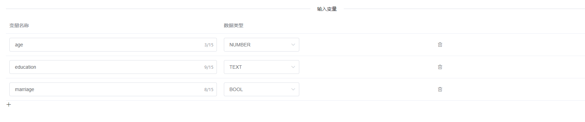
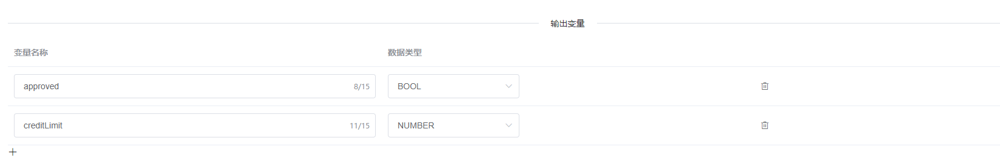
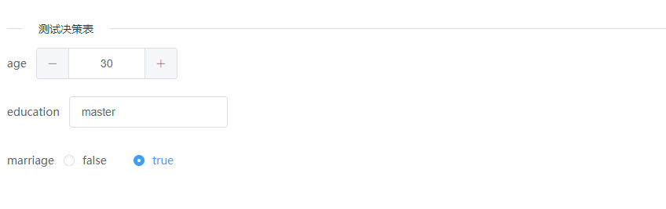
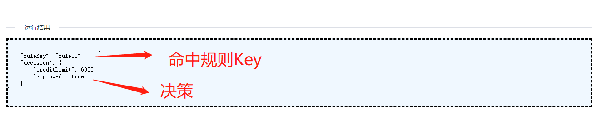
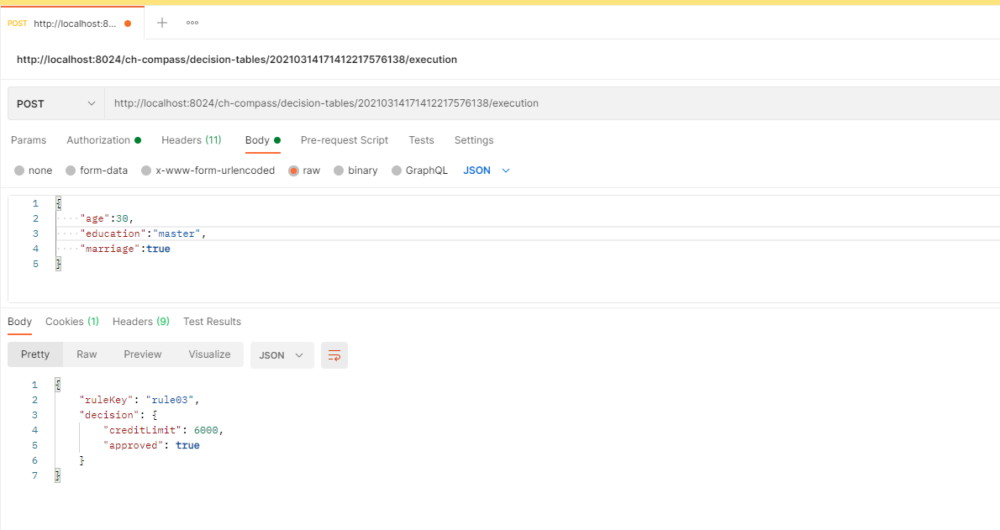

# compass

一个简单易用、轻量级、高性能的实时决策计算引擎

## 安装

1. 前置条件： Java8 或更高版本

```shell
java -version
```

2. 下载安装包 <https://github.com/chenhui-1024/compass/distribution/compass-1.0.0.jar>

3. 启动

```shell
java -jar compass-1.0.0.jar
```

启动后使用以下默认用户名和密码登录<http://localhost:8024/ch-compass/login.html>

```shell
admin|test
```

## 使用

1. 定义决策表  
   一个决策表由基本信息、输入变量、输出变量、规则和决策构成  
   1.1 定义基本信息  
   
   1.2 定义输入变量  
   
   1.3 定义输出变量  
   
   1.4 定义规则和决策  
   

2. 验证决策表  
   2.1 设置输入变量  
   
   2.2 获取验证结果
   
3. 发布决策表 草稿、发布、下线构成了决策表生命周期

4. 访问REST API  
   Compass提供RESTful API供客户端访问，以下是通过Postman访问决策表执行功能接口，返回执行结果。
   
5. 规则表达式

    


